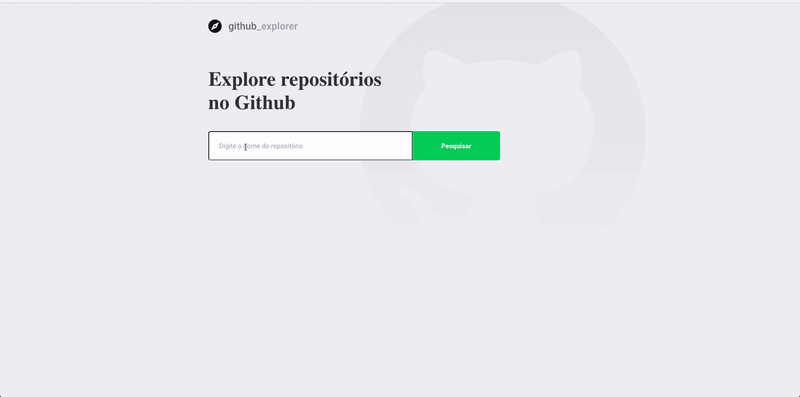

<h2 align="center">
	Github Explorer :rocket:
</h2>

<p align="center">

  <a href="https://github.com/fnoquiq/github-explorer/stargazers">
    
  </a>

  <a href="https://github.com/fnoquiq/github-explorer/issues">
    
  </a>

  <a href="https://github.com/fnoquiq/github-explorer/network/members">
    
  </a>

  <a href="https://github.com/fnoquiq/github-explorer/blob/master/LICENSE">
    
  </a>

</p>

<h1 align="center">
    
</h1>

### Iniciar aplicação

```bash

# Instale as dependências
$ yarn install

# Inicie o servidor
$ yarn start

```

## :memo: License

Esse projeto está sob a licença MIT. Veja a [LICENÇA](https://github.com/fnoquiq/github-explorer/blob/master/LICENSE) para mais detalhes.
